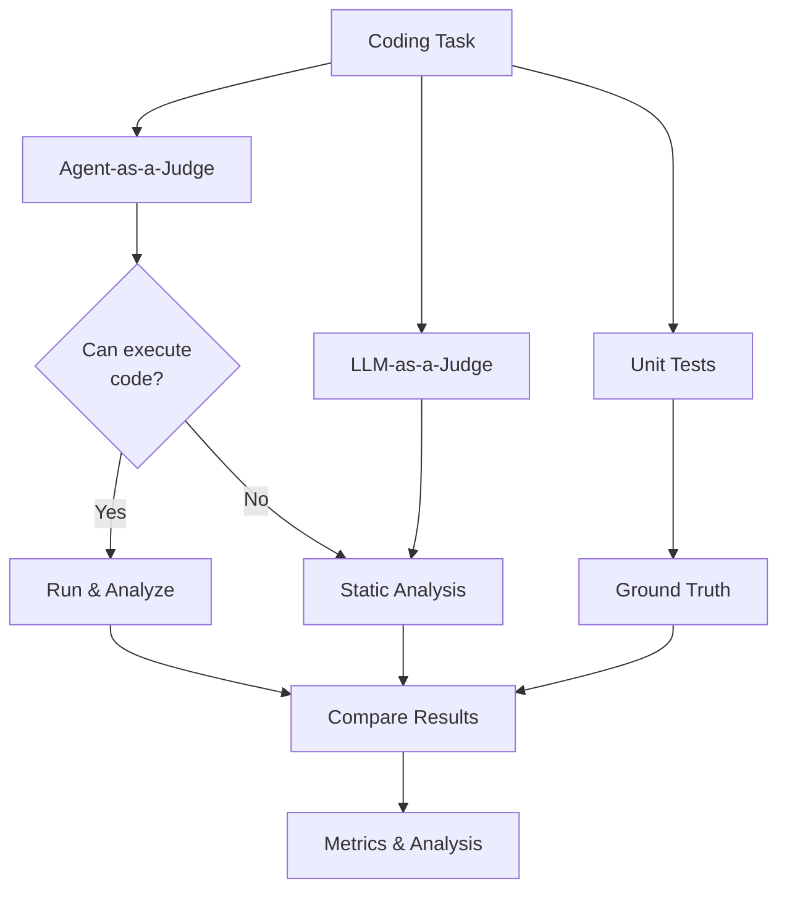

# Beyond Unit Tests: Evaluating Agent, LLM, and Traditional Judges for Coding Tasks

**Can subjective AI judges rival objective unit tests? Comparing Agent-as-a-Judge, LLM-as-a-Judge, and traditional unit testing on coding solutions.**

---

## 📋 Overview

While unit tests remain the gold standard for evaluating code correctness, creating comprehensive test suites is labor-intensive. This project investigates whether **subjective AI judges**—both agentic systems with tool access and pure language models—can serve as reliable alternatives or complements to traditional unit testing.

### Research Questions

1. **Can subjective judges match objective tests?** Do Agent-as-a-Judge and LLM-as-a-Judge provide reliable evaluations comparable to unit tests?
2. **Do domain-specific agents excel?** Are coding agents with terminal access better judges than general-purpose LLMs for code evaluation?

### Key Contributions

- 🤖 **Three-way comparison**: Agents vs. LLMs vs. Unit Tests
- 📊 **Comprehensive benchmarking**: Multiple agents, models, and task types
- 🔍 **Trajectory analysis**: Understanding *why* certain judges perform better
- 💡 **Practical insights**: Agent/model recommendations for different coding tasks

---

## 👥 Team

**Cornell University, Fall 2024**

- **Lin Shi** (ls2282@cornell.edu)
- **Yan Xiao** (yx689@cornell.edu)  
- **Tongjia Rao** (tr426@cornell.edu)

---

## 🎯 Evaluation Framework

### Three Judge Types

| Judge Type | Tool Access | Examples | Key Advantage |
|------------|-------------|----------|---------------|
| **Agent-as-a-Judge** | ✅ Terminal, file I/O | Claude Code, Codex CLI, Gemini CLI, OpenHands | Can execute code, run tests, debug |
| **LLM-as-a-Judge** | ❌ Static analysis only | GPT-4o-mini, Claude Sonnet, Gemini Flash | Fast, cost-effective |
| **Unit Tests** | ✅ Full environment | pytest, unittest | Deterministic, objective |

### Evaluation Metrics

- **Alignment**: Correlation with unit test results
- **Bias**: Position bias, length bias, consistency
- **Efficiency**: Cost per evaluation, time complexity
- **Reliability**: Self-consistency, reproducibility

---

## 🔬 Methodology

### Dataset Curation

We aggregate coding tasks from multiple benchmarks:

- **LiveCodeBench** (ICML 2025): Real-world competitive programming
- **EvoEval** (COLM 2024): Evolutionary code generation  
- **CodeJudge-Eval**: Code quality assessment

Each task includes:
- Problem description with constraints
- Reference solution
- Comprehensive unit tests
- Difficulty rating

### Evaluation Pipeline

## 🎓 Research Impact

### Applications

1. **Educational Assessment**: Scalable automated grading with quality feedback
2. **Code Review**: Pre-screening before human review
3. **Developer Tools**: Real-time code quality suggestions
4. **Benchmark Evaluation**: Assessing LLM code understanding

### Expected Outcomes

- **Alignment Analysis**: Quantify when subjective judges match objective tests
- **Agent Recommendations**: Best judge per task type (algorithms, debugging, optimization)
- **Efficiency Trade-offs**: Cost vs. accuracy curves for different judges
- **Trajectory Insights**: Why agents outperform LLMs on certain tasks

---

## 📚 Related Work

- **LLM-as-a-Judge** (NeurIPS 2023): [arXiv:2306.05685](https://arxiv.org/abs/2306.05685)
- **Agent-as-a-Judge** (ICML 2025): [arXiv:2410.10934](https://arxiv.org/abs/2410.10934)
- **LiveCodeBench** (ICML 2025): [arXiv:2403.07974](https://arxiv.org/abs/2403.07974)
- **EvoEval** (COLM 2024): [arXiv:2403.19114](https://arxiv.org/abs/2403.19114)
- **CodeJudge-Eval**: [arXiv:2408.10718](https://arxiv.org/abs/2408.10718)
- **OpenHands** (ICLR 2025): [arXiv:2407.16741](https://arxiv.org/abs/2407.16741)
